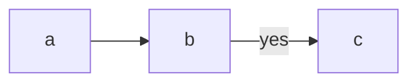
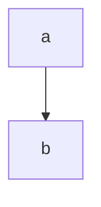
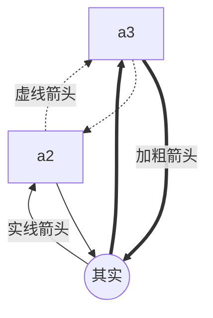
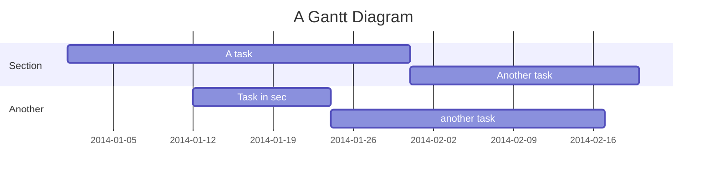

介绍MARKDOWN语法的使用以及预览效果。

* content
{:toc}


[TOC]
----
标题

# 一级标题

## 二级标题 {ignore=true} 

### 三级标题
#### 四级标题
##### 五级标题
###### 六级标题

正文样式

[百度连接](www.baidu.com)

**加粗**

*斜体*

<del>删除线</del>

~~~删除线~~

==高亮==

* 无序列表1
    * 无序1-1
    * 无序1-2 
* 无序列表2

+ 否
1. 实例1
    1. 实例1-1 
    2. 实例1-2
2. 实例2
    1. 实例2-1 
    2. 实例2-2

- [x] 复选框1
- [ ] 复选框2


> 引用

行内代码 `alert('Hello World')`;

水平分割线 (HR) :

--------
脚注

这是一个链接到谷歌的[^1]。
这是一个链接到谷歌的[^2]。
这是一个链接到谷歌的[^3]。

[^1]: This is my first footnote
[^2]: Visit http://ghost.org
[^3]: A final footnote

--------
# 表格

| id |name|subname|
|:-|:-|:-|
|1|A1|B1|
|2|A2|B2|
|3|A3|B3|

对齐规则

```
- 默认左对齐
:- 左对齐
-:右对齐
:-:居中
```

列宽度调整

`-`表示列的宽度权重，比如如下，`--`、`-`，表示第一列的宽度是第二列的俩倍

|id|name| 
|:--|:-|
 |1|A1|

--------
# 流程图








-----

代码片段

```js
    function fancyAlert(arg) {
        if(arg) {
            $.facebox({div:'#foo'})
        }

    }
```
